# Web API & Database: Part 1 - Setup

## Introduction

The objective of this and the following tutorials is to build a web application consisting of a Database, Web API and a Web Client. 

The API will act as a web interface for the Database, allowing data access via HTTP.

The Client will act as the user interface to read, create, update, and delete data objects.

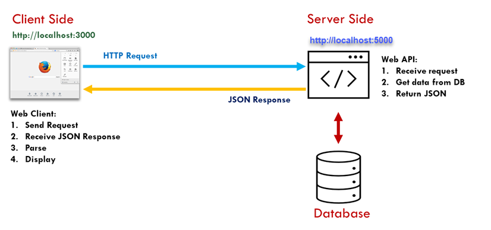

In this tutorial you will set up the database and connect it to a web API.  The database will be a cloud based service called **[Supabase](https://supabase.com/)**. This service is based on **[PostgreSQL](https://www.postgresql.org/)**, a very popular relational database. The service includes API access to the database as well as direct access, which we will use here.


## Setting Up a Supabase account

Supabase is free to use for small projects and you can sign up using your GitHub account. 
It is also very well documented.

To set up your account, visit <https://supabase.com/> and sign in using your GitHub account. If you don’t have one, set up a GitHub account using your student email account.

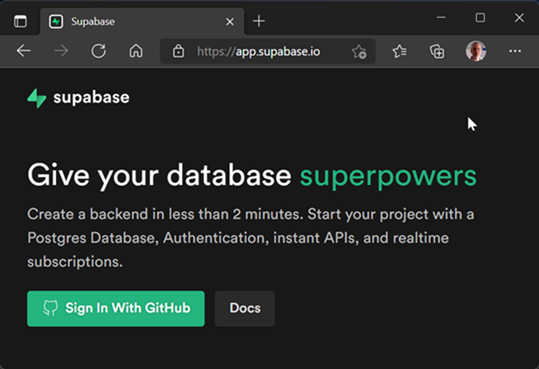


### Creating a new database

#### 1. Add a new Supabase Project

After logging in choose **New Project** from the dashboard.

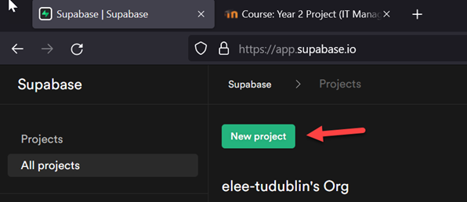


Add the the project to your organisation and fill in the details. Name your new database **products**.

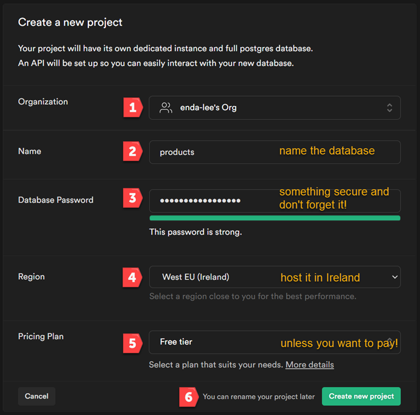


It may take a few minutes to setup the database. When complete, the database can be configured via the tools in the Supabase dashboard.

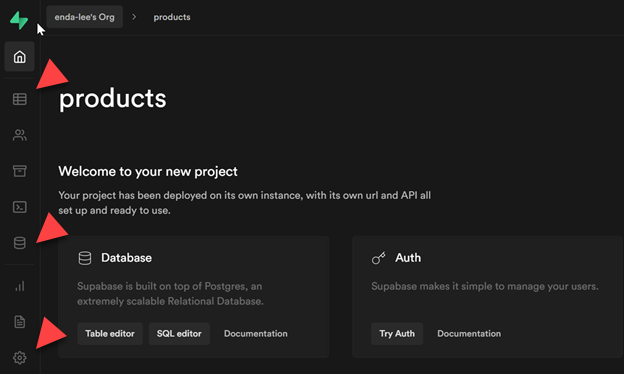


For example, the **Table Editor** can be used to add tables to the products database.

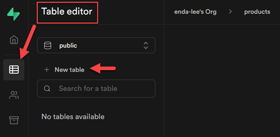


Leave this for now as we will be using another method to add tables and data later.


## Connecting to the Database from a Web API

You will find a start application in the code section of this repository.

1. Download it, unzip, and open the application folder in VS Code. 
2. Open a new terminal window and install the dependencies by using the  ```npm install``` command.
3. Run the application using ```npm run dev``` and open http://localhost:5000 in a web browser to verify that it is working.

### Install dotenv

In a production environment, important settings, etc. are typically stored as **```environment variables```** in the host operating system. These variables are then accessed in scripts using ```process.env```

The [dotenv](https://www.npmjs.com/package/dotenv) package will allow loading of environment variables from a file in the application root named ```.env``` This is convenient when developing an application.

To install:

1. first stop the server by pressing ```ctrl-c``` in the terminal. 

2. Install using

   ```
   npm install dotenv
   ```

   

3. Open ```app.js``` and add the dependency to the app using ```require('dotenv').config();``` just after the other dependencies.

   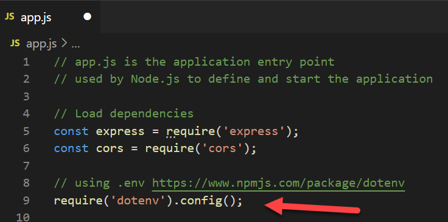


### Setup the database using Prisma

**[Prisma](https://www.prisma.io/)** is a server-side library which allows database queries to be written using JavaScript. It works by adding a *layer of abstraction* between JavaScript and a database. This is usually referred to as `object relational mapping` or `ORM`. It enables the same ```data model``` to be used across different database platforms including `PostgreSQL`, `MySQL`, `MSSQL`, `SQLite`, and `MongoDB`.

In our application, `Prisma` will be used to define the data model and manage access to the database. A data model, or schema will be defined and then applied to the database.


#### Setup and Initialise Prisma

The Prisma command line interface provides a way to manage the Prisma service. 

1. Use the following command to install it as a development dependency in the terminal

   ```
   npm install prisma --save-dev 
   ```

   

2. After it has installed, start the CLI in your terminal (note the command is **`npx`** and con the usual `npm`): 

   ```
   npx prisma
   ```

   

3. Add a prisma configuration to this project

   ```terminal
   npx prisma init 
   ```
   
   


#### Configure to the database connection 

The previous step added a file named ```.env```  to the application root. It contains Prisma instructions for setting the database URL, with an example. 

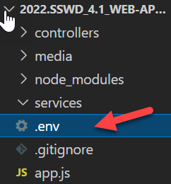


The sample value needs to be modified so that it references the Supabase database created earlier.

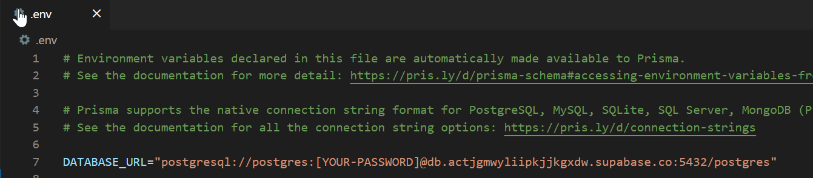


 The URL and password can be found in database settings in Supabase:

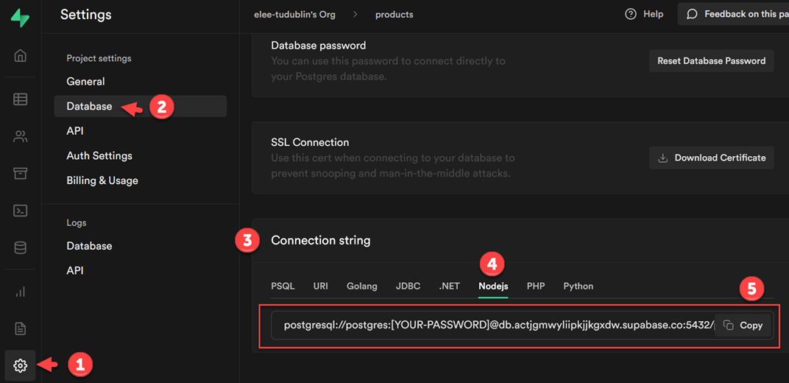

Copy the Node.js version of the connection string and paste it into ```.env```, replacing the sample vale. 

Change the ```[YOUR-PASSWORD]``` placeholder to the database password set earlier. 

Also add the schema parameter `?schema=public` to the end of your `DATABSE_URL`.

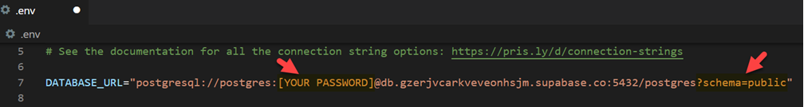

​	

To get syntax highlighting in  ```.env```, install the ```dotenv``` extension in VS Code:

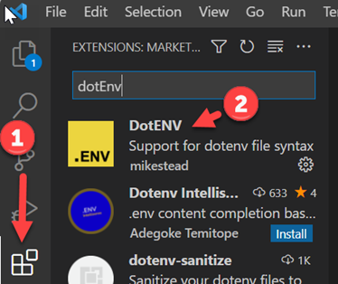


#### Define a database schema and setup the database tables

During initialisation, Prisma added a folder named ```prisma``` which contains a file named `prisma.schema`. This is where the Prisma data model (schema) and database connection will be defined.

The `Entity Relationship Diagram` below represents a simple data model for storing categories and products in the database. It defines `attributes`  (or fields) - (id, product_name, etc.) for the `entities`.

The `id` attribute is defined as a `primary key`, a *unique identifier* for each entity.

The `ERD` also defines a`one-to-many` relationship between the entities. **One** `category` can reference **Many** `products`. The relationship is created by adding a `foreign key` in `product`. In the example, `category_id ` in `product` is a foreign key, used to identify which the category a product is  part of.


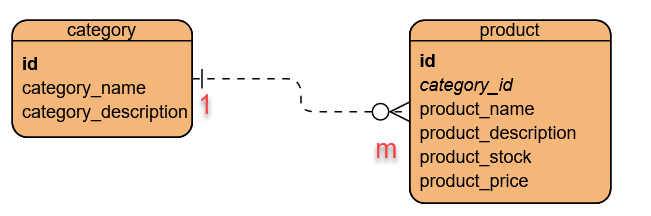


#### Prisma Schema / Data Model

The following **Prisma Schema** defines:

1. The Prisma Client.
2. The data source using the `DATABASE_URL`.
3. The **data model**  for the application - based on the `ERD` above.

Here is the completed schema definition. Copy this code into the `prisma/schema.prisma` file. Read the code comments for details.  The [Prisma Schema documentation](https://www.prisma.io/docs/reference/api-reference/prisma-schema-reference) is linked from the reference section i the references section.

```javascript
// Defines The Prisma Client
generator client {
  provider = "prisma-client-js"
}

// DB connection - based on the value of the DATABASE_URL env variable 
datasource db {
  provider = "postgresql"
  url      = env("DATABASE_URL")
}

// Data Model for category
model category {
  // The primary key is annotated by @id
  // @default(autoincrement) generates unique id values on insert by default
  id                   Int  @id @default(autoincrement())
  category_name        String

  // Description is optional (String? is nullable)
  category_description String?

  // a category contains many products
  product              product[]
}

// Data Model for product
model product {
  id                  Int @id @default(autoincrement())
  category_id         Int
  // @db.VarChar(255) defines the database datatype and max length
  product_name        String @db.VarChar(255)
  product_description String @db.VarChar
  // @default(0) sets a default value
  product_stock       Int    @default(0)
  // default 0, a decimal number 
  product_price       Float  @default(0) @db.Real

  // A product can be in a category (? indicates that this value can be null)
  // @relation sets up the foreign key - category_id is the id of the category this product belos to
  // onDelete and onUpdate define what happens if the category a product belongs to is updated or deleted.
  category            category? @relation(fields: [category_id], references: [id], onDelete: NoAction, onUpdate: NoAction)
}

```

For syntax highlighting checking in the schema file, install the Prisma VS Code Extension. 

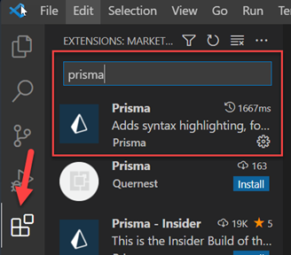


#### Apply the schema to the database

The next task is to *migrate* the Prisma schema to the database. This will translate the data model into the appropriate database tables and relations. Use start the process, enter the following command in the terminal:

```terminal
npx prisma migrate dev --name init
```

You will see output as the migration progresses. The whole process may take a couple of minutes. When complete you will see something like this:

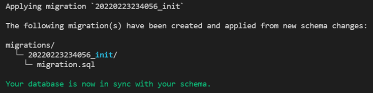


#### Check the results in Supabase

To see the results, open the Supabase table editor for your database. You should see the following:

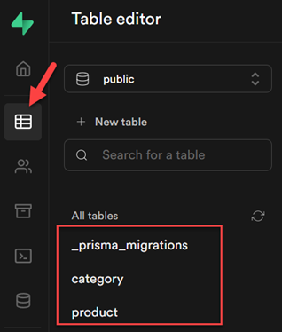


To see the table definition, click on the `product` table, then use the menu to access the `Edit Table` function.

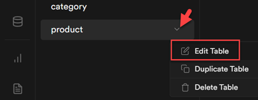


You will see the product table as defined by the Prisma migration


Prisma can also be used to generate a schema from an existing database through a process called *introspection*. https://www.prisma.io/docs/getting-started/setup-prisma/add-to-existing-project/relational-databases/introspection-node-postgres

#### Adding some sample data

Prisma can be used to *seed* the database with data but here we will insert some data using `SQL` in Supabase.

Open the Supabase SQL editor

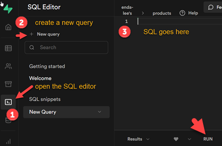


Paste in the following SQL into the query window and **run**. This contains the `insert` statements to add rows to category and then product.

```sql
-- sample data for product database- SQL inserts

-- category table data
INSERT INTO category("id", category_name, category_description) VALUES
(1, 'Books', 'Paper and hard cover, fiction and non-fiction');
INSERT INTO category("id", category_name, category_description) VALUES
(2, 'Computer', 'Desktop, laptops, and accessories');
INSERT INTO category("id", category_name, category_description) VALUES
(3, 'Entertainment', 'Home electronicsa, TV, HiFi, etc.');
INSERT INTO category("id", category_name, category_description) VALUES
(4, 'Kitchen', 'Kitchen + cooking appliances');
INSERT INTO category("id", category_name, category_description) VALUES
(5, 'Laundry', 'Clothes washers, dryers, and accesories');
INSERT INTO category("id", category_name, category_description) VALUES
(6, 'Mobile Devices', 'Mobile phones, tablets, and accessories');
INSERT INTO category("id", category_name, category_description) VALUES
(7, 'Furniture', 'Home and home office furniture');


-- the product table data
INSERT INTO product("id", category_id, product_name, product_description, product_stock, product_price) VALUES
(6, 4, 'Kettle', 'Steel Electric Kettle', 100, 55::REAL);
INSERT INTO product("id", category_id, product_name, product_description, product_stock, product_price) VALUES
(7, 4, 'Fridge freezer', 'Fridge + freezer large', 45, 799::REAL);
INSERT INTO product("id", category_id, product_name, product_description, product_stock, product_price) VALUES
(8, 2, 'Microsoft Surface Laptop 8', '16GB ram, 512GB SSD', 5, 1299::REAL);
INSERT INTO product("id", category_id, product_name, product_description, product_stock, product_price) VALUES
(9, 2, '14inch Laptop', 'HP laptop,16GB RAM,1TB SSD', 45, 1099::REAL);
INSERT INTO product("id", category_id, product_name, product_description, product_stock, product_price) VALUES
(10, 6, 'Samsung 10inch Tablet', 'Android6GB ram, 128GB storage, 10inch screen', 5, 99::REAL);
INSERT INTO product("id", category_id, product_name, product_description, product_stock, product_price) VALUES
(11, 3, '60inch TV', 'Sony 4K,OLED,Smart TV', 12, 1899::REAL);
INSERT INTO product("id", category_id, product_name, product_description, product_stock, product_price) VALUES
(12, 5, 'Clothes Washing Machine', '1600rpm spin,A+++ rated,10KG', 50, 699::REAL);
INSERT INTO product("id", category_id, product_name, product_description, product_stock, product_price) VALUES
(13, 6, 'iPhone 13', '128GB', 5, 850::REAL);
INSERT INTO product("id", category_id, product_name, product_description, product_stock, product_price) VALUES
(14, 1, 'Azure Web Apps', 'Paperback, January 2020, Cloud publishing', 50, 19::REAL);
INSERT INTO product("id", category_id, product_name, product_description, product_stock, product_price) VALUES
(16, 7, 'Bed', 'Super King size,super comfort mattress', 5, 899::REAL);
INSERT INTO product("id", category_id, product_name, product_description, product_stock, product_price) VALUES
(17, 2, 'Learning JavaScript', 'Become a JavaScript expert in 2 hours!', 10, 12::REAL);
INSERT INTO product("id", category_id, product_name, product_description, product_stock, product_price) VALUES
(18, 7, 'Desk', 'Small computer desk', 5, 99::REAL);
INSERT INTO product("id", category_id, product_name, product_description, product_stock, product_price) VALUES
(15, 1, 'SQL and No SQL for beginners', 'Paperback, Oct 2021, Cloud publishing', 10, 399::REAL);
INSERT INTO product("id", category_id, product_name, product_description, product_stock, product_price) VALUES
(20, 7, 'Table', 'A large kitchen table', 40, 800::REAL);
```

 

Use the table editor to view the new data


The data can also be viewed by running the following `SQL`

```sql
select * from category;
```

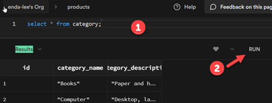


## Using the API to retrieve data

At this point the database has been created and connected to the application using Prisma. The next step is to add functionality to accept requests for the data via HTTP and send back the data as JSON. 

The diagram shows the steps from client's initial request to receiving a response.


### 1. Add the Controller

The `product controller` will define an `endpoint` to handle the request. Add `productController.js` to the `controllers` folder.

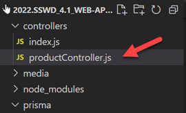


Add the following code, which for now returns a placeholder message

```javascript
// This is the product controller

// Import router package
const router = require('express').Router();


// This endpoint will return all product data from the database
router.get('/', async(req, res) => {

    // set content type of response body in the headers
    // As this is defined globally in app.js it can be ommitted from here
    res.setHeader('Content-Type', 'application/json');

    // Send a  response - this app will be a web api so no need to send HTML
    res.json('All products');

});

// export
module.exports = router;
```


### 2. Set up routing for the controller

Add a route to `app.js` for the new controller:

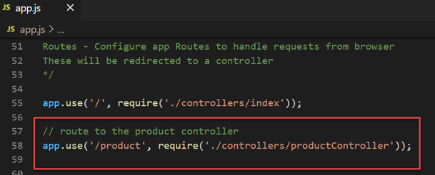


Then test the application by starting in the terminal

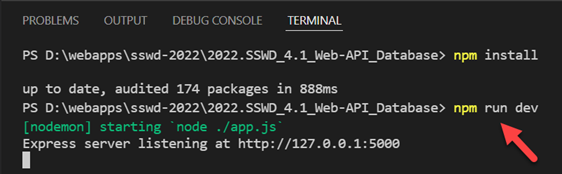


Then open http://localhost:5000/product in a web browser

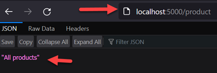


### 3. Add the service

The controller will pass the request details to a service which will then generate the response data. For the now the service will be very simple as this request does not require anu validation or further logic.

Add `productService.js` to the `services` folder.

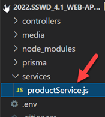


Then open for editing. For now the service will simply return a message

```javascript
// Product service functions

// Function to get all products
//
async function getProducts() {
    
    // a place holder for now 
    const products = 'All Products from service'
  
    // return products
    return products;
  }
  
// Module exports
// expose these functions
module.exports = {
    getProducts
};
```


Then, in `productController.js` import the service and call it in the endpoint. The main difference is that the result is generated by the `service` and not the `controller`. The benefits will become apparent as the application gets more complex.

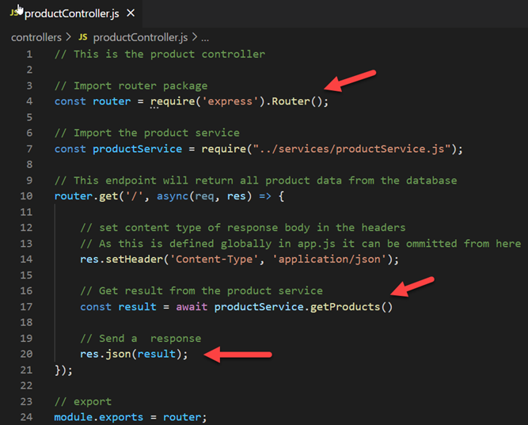


After saving updates, test again. The result should be much the same.

### 4. Data Access

Data access will be via the Prisma Client. Install it in the terminal using the following command

```
npm install @prisma/client
```

The client will be used to query the database and return results in data access functions.

Start by creating a folder named `dataAcess` and to that `productData.js`

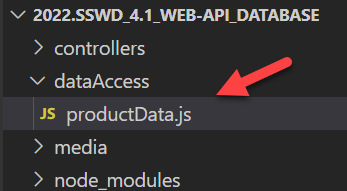


Open `productData.js` for editing. The following code does the following:

1. Import the `Prisma client` dependencies.
2. Declare an instance of the client, `prisma`.
3. define a function `getProducts()` which will use `prisma` to get all products from the database and then return them.

```javascript
// Data access functions for products

// Import dependencies
const { PrismaClient } = require('@prisma/client');

// declare an instance of the client
const prisma = new PrismaClient();

// Get all products from DB
//
async function getProducts() {
    // define variable to store products
    let products;

    try {  
        // Get all products
        // https://www.prisma.io/docs/reference/api-reference/prisma-client-reference#findmany
        products = await prisma.product.findMany();

    // Catch and log errors to server side console 
    } catch (err) {
        console.log('DB Error - get all products: ', err.message);
    } finally {

    }
    // return all products found
    return products;
}


// Export 
module.exports = {
    getProducts,
};

```


#### Call data access from the product service

Now that data access has been defined, it can be accessed in the service.  Import `productData` then call `productData.getProducts()` to get a list of all products in the database.

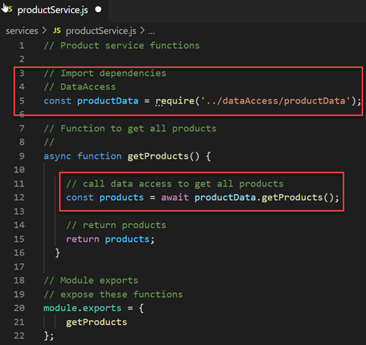


### 5. Test the finished application

Run the application and load http://localhost:5000/product in a web browser. If everything worked then you should see the JSON response.

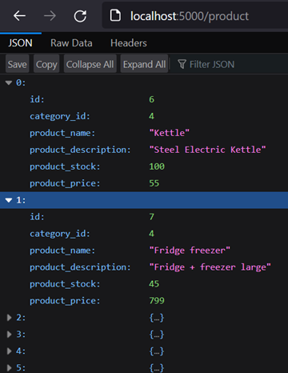


## Exercises:

Following the example above, add the functionality required to retrieve all categories from the database.


## References

Prisma Tutorial - https://www.prisma.io/docs/getting-started/setup-prisma/add-to-existing-project/relational-databases-typescript-postgres

Prisma Schema Reference - https://www.prisma.io/docs/reference/api-reference/prisma-schema-reference

Prisma Queries - https://www.prisma.io/docs/reference/api-reference/prisma-client-reference#model-queries


------

Enda Lee 2022
